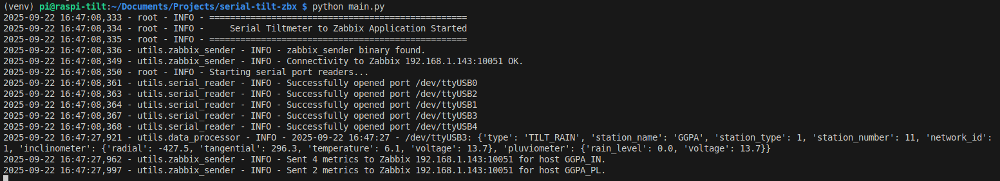

[](https://www.python.org/) 
 
 

[](https://discord.gg/bf6rWDbJ) 
[](https://www.docker.com/) 
[](https://github.com/rotoapanta/raspberry-api) 
[](https://www.linux.org/) 
[](https://www.linkedin.com/in/roberto-carlos-toapanta-g/) 
[](#change-log) 
 
[](https://opensource.org/licenses/MIT)

# <p align="center">Serial Tiltmeter to Zabbix</p>

Este proyecto lee, procesa y envía datos de inclinómetros y pluviómetros desde puertos serie a un servidor Zabbix para su monitoreo en tiempo real.

## Características

- Lectura Concurrente: Monitorea múltiples puertos serie de forma simultánea.
- Procesamiento de Datos: Parsea tramas de datos específicas de los sensores.
- Integración con Zabbix: Utiliza `zabbix_sender` para enviar métricas a un servidor Zabbix.
- Logging Robusto: Registra la actividad de la aplicación, incluyendo errores, con rotación de archivos.
- Apagado Limpio: Maneja SIGINT/SIGTERM para detener hilos de forma ordenada.
- Almacenamiento Seguro: Evita condiciones de carrera al escribir archivos TSV.
- Configuración Flexible: Gestiona la configuración de puertos y Zabbix a través de archivos externos.
- Instalación Automatizada: Incluye scripts para facilitar la configuración en Raspberry Pi.
- Ejecución como Servicio: Permite la instalación como un servicio `systemd` para operación continua.
- Resiliencia de Puertos Serie: Política de reintentos configurable por puerto y un supervisor que re-habilita puertos cuando se recuperan.

## Requisitos del Sistema

Este proyecto está diseñado para sistemas operativos basados en Debian (como Raspberry Pi OS, Ubuntu, etc.). Antes de la instalación, asegúrate de que tu sistema tenga los siguientes paquetes. El script `setup_pi.sh` intentará instalarlos automáticamente.

- python3
- python3-venv (para la creación de entornos virtuales)
- git (para clonar el repositorio)
- zabbix-sender (para enviar datos a Zabbix)

---

## Implementación en Raspberry Pi (Recomendado)

Esta es la forma recomendada para poner el sistema en producción. Los scripts automatizan la instalación de dependencias y la configuración del servicio.

### 1. Preparación

- Clona este repositorio en tu Raspberry Pi:
  ```bash
  git clone https://github.com/tu-usuario/serial-tilt-zbx.git
  cd serial-tilt-zbx
  ```

### 2. Ejecutar el Script de Configuración

- Este script instalará las dependencias del sistema (como `python3-venv` y `zabbix-sender`) y las librerías de Python necesarias. Ejecuta apt en modo no interactivo y actualiza pip/setuptools/wheel antes de instalar los requisitos.
  ```bash
  chmod +x setup_pi.sh
  ./setup_pi.sh
  ```
  Nota: El script podría solicitar tu contraseña (`sudo`) si necesita instalar paquetes del sistema.

### 3. Configurar la Aplicación

- MUY IMPORTANTE: Edita los archivos de configuración para que coincidan con tu hardware y servidor.
  - `config.json`: Define `serial_ports` y (opcionalmente) los ajustes de reintento/supervisor bajo `serial_retry` y `serial_supervisor`.
  - `config/zabbix_config.py`: Define la dirección de tu servidor Zabbix.
  - `config/station_mapping.py`: Mapea los IDs de las estaciones a los nombres de host de Zabbix.

### Opcional: Permisos de serie y nombres estables

- Agrega tu usuario al grupo `dialout` y vuelve a iniciar sesión:
  ```bash
  sudo usermod -a -G dialout $USER
  # Cierra sesión y vuelve a iniciarla
  ```
- Crea reglas udev para nombres estables:
  ```bash
  sudo tee /etc/udev/rules.d/99-serial-names.rules >/dev/null <<'R'
  SUBSYSTEM=="tty", ATTRS{idVendor}=="067b", ATTRS{idProduct}=="2303", SYMLINK+="ttyUSB_TILT"
  SUBSYSTEM=="tty", ATTRS{idVendor}=="0403", ATTRS{idProduct}=="6001", SYMLINK+="ttyUSB_PLUV"
  R
  sudo udevadm control --reload-rules && sudo udevadm trigger
  ```
  Luego referencia `/dev/ttyUSB_TILT`, `/dev/ttyUSB_PLUV` en tu configuración.

### 4. Instalar como un Servicio (Opcional pero Recomendado)

- Para que la aplicación se inicie automáticamente y se mantenga en ejecución, instálala como un servicio `systemd`.
  ```bash
  chmod +x install_service.sh
  ./install_service.sh
  ```
- El script generará un archivo `.service` y te mostrará los comandos exactos para moverlo, habilitarlo e iniciarlo. Sigue las instrucciones que aparecen en la terminal. La unidad generada usa Type=simple, Restart=on-failure, LimitNOFILE=4096 y soporta un EnvironmentFile opcional en `/etc/default/serial-tilt-zbx`.

  O ejecuta explícitamente estos comandos:
  ```bash
  sudo mv $(pwd)/serial-tilt-zbx.service /etc/systemd/system/serial-tilt-zbx.service
  sudo systemctl daemon-reload
  sudo systemctl enable serial-tilt-zbx.service
  sudo systemctl start serial-tilt-zbx.service
  ```

- Para gestionar el servicio:
  - Ver estado: `sudo systemctl status serial-tilt-zbx.service`
  - Ver logs: `journalctl -u serial-tilt-zbx.service -f`

---

## Instalación Manual (Entorno de Desarrollo)

Sigue estos pasos para una instalación manual en cualquier sistema Linux.

1. Clona el repositorio:
   ```bash
   git clone https://github.com/tu-usuario/serial-tilt-zbx.git
   cd serial-tilt-zbx
   ```

2. Instala `zabbix-sender`:
   - En sistemas Debian/Ubuntu/Raspberry Pi OS:
     ```bash
     sudo apt-get update && sudo apt-get install zabbix-sender
     ```

3. Crea y activa un entorno virtual:
   ```bash
   python3 -m venv venv
   source venv/bin/activate
   ```

4. Instala las dependencias de Python:
   ```bash
   pip install --upgrade pip setuptools wheel
   pip install -r requirements.txt
   ```

5. Configura y ejecuta:
   - Edita los archivos en el directorio `config/`.
   - Ejecuta la aplicación:
     ```bash
     python main.py
     ```

## Configuración de reintentos y supervisor de serie

- Valores globales en `config.json`:
  - `serial_retry`: `{ "max_attempts": 3, "delay_seconds": 5, "on_fail": "disable" }`
  - `serial_supervisor`: `{ "auto_reenable": true, "reenable_interval_seconds": 20 }`
- Overrides por puerto: añade `max_retries`, `retry_delay`, `on_fail` dentro de una entrada específica en `serial_ports`.
- Comportamiento:
  - Tras `max_attempts` fallos: `on_fail` define si continuar reintentando, deshabilitar el hilo del puerto o detener la app.
  - Los puertos deshabilitados son sondeados por el supervisor y se re-habilitan automáticamente cuando estén disponibles.

Ejemplo de `config.json`:

```json
{
  "serial_ports": [
    { "port": "/dev/ttyUSB0", "baudrate": 9600, "bytesize": 8, "parity": "N", "stopbits": 1, "timeout": 1 },
    { "port": "/dev/ttyUSB4", "baudrate": 9600, "bytesize": 8, "parity": "N", "stopbits": 1, "timeout": 1,
      "max_retries": 3, "retry_delay": 5, "on_fail": "disable" }
  ],
  "serial_retry": { "max_attempts": 3, "delay_seconds": 5, "on_fail": "disable" },
  "serial_supervisor": { "auto_reenable": true, "reenable_interval_seconds": 20 }
}
```

Notas:
- Los cambios en `config.json` se aplican tras reiniciar la aplicación.
- Los logs mostrarán cuando un puerto se deshabilita y cuando es re-habilitado por el supervisor.

## Pruebas

Para ejecutar las pruebas unitarias, usa el siguiente comando desde el directorio raíz del proyecto:

```bash
python -m unittest discover tests
```

## Archivos de datos

Los encabezados TSV incluyen una línea en blanco después de `IDENTIFICADOR:` antes de la línea de encabezado `FECHA`/`TIEMPO`.

## Ejemplo de salida en consola



Salida de texto de ejemplo:

```
(venv) pi@raspi-tilt:~/Documents/Projects/serial-tilt-zbx $ python main.py

2025-09-22 16:47:08,333 - root - INFO - ==================================================

2025-09-22 16:47:08,334 - root - INFO - Serial Tiltmeter to Zabbix Application Started

2025-09-22 16:47:08,335 - root - INFO - ==================================================

2025-09-22 16:47:08,336 - utils.zabbix_sender - INFO - zabbix_sender binary found.

2025-09-22 16:47:08,349 - utils.zabbix_sender - INFO - Connectivity to Zabbix 192.168.1.143:10051 OK.

2025-09-22 16:47:08,350 - root - INFO - Starting serial port readers...

2025-09-22 16:47:08,361 - utils.serial_reader - INFO - Successfully opened port /dev/ttyUSB0

2025-09-22 16:47:08,363 - utils.serial_reader - INFO - Successfully opened port /dev/ttyUSB2

2025-09-22 16:47:08,364 - utils.serial_reader - INFO - Successfully opened port /dev/ttyUSB1

2025-09-22 16:47:08,367 - utils.serial_reader - INFO - Successfully opened port /dev/ttyUSB3

2025-09-22 16:47:08,368 - utils.serial_reader - INFO - Successfully opened port /dev/ttyUSB4

2025-09-22 16:47:27,921 - utils.data_processor - INFO - 2025-09-22 16:47:27 - /dev/ttyUSB3: {'type': 'TILT_RAIN', 'station_name': 'GGPA', 'station_type': 1, 'station_number': 11, 'network_id': 1, 'inclinometer': {'radial': -427.5, 'tangential': 296.3, 'temperature': 6.1, 'voltage': 13.7}, 'pluviometer': {'rain_level': 0.0, 'voltage': 13.7}}

2025-09-22 16:47:27,962 - utils.zabbix_sender - INFO - Sent 4 metrics to Zabbix 192.168.1.143:10051 for host GGPA_IN.

2025-09-22 16:47:27,997 - utils.zabbix_sender - INFO - Sent 2 metrics to Zabbix 192.168.1.143:10051 for host GGPA_PL.
```

Nota: Para renderizar la captura de pantalla, coloca una imagen en `images/console-output.png` en el repositorio.

## Comentarios

Si tienes comentarios o sugerencias, contáctanos en robertocarlos.toapanta@gmail.com

## Soporte

Para soporte, escribe a robertocarlos.toapanta@gmail.com o únete a nuestro canal de Discord.

## Licencia

[GPL v2](https://www.gnu.org/licenses/gpl-2.0)

## Autores

- [@rotoapanta](https://github.com/rotoapanta)

## Más información

* [Cómo usar Rsync para sincronizar directorios locales y remotos](https://www.digitalocean.com/community/tutorials/how-to-use-rsync-to-sync-local-and-remote-directories-es)

## Enlaces

[](https://www.linkedin.com/in/roberto-carlos-toapanta-g/)

[](https://twitter.com/rotoapanta)
